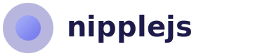

<picture>
  <source media="(prefers-color-scheme: dark)" srcset="./assets/nipplejs-dark.svg">
  <source media="(prefers-color-scheme: light)" srcset="./assets/nipplejs-light.svg">
  
</picture>

> A vanilla virtual joystick for touch capable interfaces


[](https://npmjs.org/package/nipplejs)
[](https://npmjs.org/package/nipplejs)

**[Documentation](https://yoannmoinet.github.io/nipplejs/)** · **[Interactive Demos](https://yoannmoinet.github.io/nipplejs/#demos)** · **[Migration Guide](https://yoannmoinet.github.io/nipplejs/migration/)**

## Table Of Contents <!-- #omit in toc -->
<details>

<!-- #toc -->
-   [Install](#install)
-   [Demo](#demo)
-   [Usage](#usage)
-   [Options](#options)
    -   [`options.zone`](#optionszone)
    -   [`options.color`](#optionscolor)
    -   [`options.size`](#optionssize)
    -   [`options.threshold`](#optionsthreshold)
    -   [`options.fadeTime`](#optionsfadetime)
    -   [`options.multitouch`](#optionsmultitouch)
    -   [`options.maxNumberOfJoysticks`](#optionsmaxnumberofjoysticks)
    -   [`options.dataOnly`](#optionsdataonly)
    -   [`options.position`](#optionsposition)
    -   [`options.mode`](#optionsmode)
    -   [`options.restJoystick`](#optionsrestjoystick)
    -   [`options.restOpacity`](#optionsrestopacity)
    -   [`options.catchDistance`](#optionscatchdistance)
    -   [`options.lockX`](#optionslockx)
    -   [`options.lockY`](#optionslocky)
    -   [`options.shape`](#optionsshape)
    -   [`options.dynamicPage`](#optionsdynamicpage)
    -   [`options.follow`](#optionsfollow)
-   [API](#api)
    -   [NippleJS instance (manager)](#nipplejs-instance-manager)
    -   [Logging](#logging)
    -   [nipple instance (joystick)](#nipple-instance-joystick)
    -   [`joystick.on`, `joystick.off`](#joystickon-joystickoff)
    -   [`joystick.ui`](#joystickui)
    -   [`joystick.destroy()`](#joystickdestroy)
    -   [`joystick.setPosition(cb, { x, y })`](#joysticksetpositioncb-x-y-)
    -   [`joystick.identifier`](#joystickidentifier)
    -   [`joystick.trigger(type [, data])`](#joysticktriggertype-data)
    -   [`joystick.position`](#joystickposition)
    -   [`joystick.frontPosition`](#joystickfrontposition)
-   [Events](#events)
    -   [manager only](#manager-only)
    -   [manager and joysticks](#manager-and-joysticks)
-   [Contributing](#contributing)
<!-- #toc -->

</details>

## Install

```bash
npm install nipplejs --save
```

----

## Demo
Check out the [interactive demos](https://yoannmoinet.github.io/nipplejs/#demos) on the documentation website.

----

## Usage

Import it the way you want into your project :

```javascript
// CommonJS
var manager = require('nipplejs').create(options);
```

```javascript
// AMD
define(['nipplejs'], function (nipplejs) {
    var manager = nipplejs.create(options);
});
```

```javascript
// Module
import nipplejs from 'nipplejs';

nipplejs.create(options);
```

```html
<!-- Global -->
<script src="./nipplejs.js"></script>
<script>
    var manager = nipplejs.create(options);
</script>
```

**:warning: NB :warning:** Your joystick's container **must** have a CSS `position` value set (`relative`, `absolute`, or `fixed`). Without it, the joystick will not be positioned correctly. The library warns in the console if `position: static` is detected.

----

## Options
You can configure your joystick in different ways :

```javascript
var options = {
    zone: Element,                  // active zone
    color: String,
    size: Integer,
    threshold: Float,               // before triggering a directional event
    fadeTime: Integer,              // transition time
    multitouch: Boolean,
    maxNumberOfJoysticks: Number,   // when multitouch, what is too many?
    dataOnly: Boolean,              // no dom element whatsoever
    position: Object,               // preset position for 'static' mode
    mode: String,                   // 'dynamic', 'static' or 'semi'
    restJoystick: Boolean|Object,   // Re-center joystick on rest state
    restOpacity: Number,            // opacity when not 'dynamic' and rested
    lockX: Boolean,                 // only move on the X axis
    lockY: Boolean,                 // only move on the Y axis
    catchDistance: Number,          // distance to recycle previous joystick in 'semi' mode
    shape: String,                  // 'circle' or 'square'
    dynamicPage: Boolean,           // Enable if the page has dynamically visible elements
    follow: Boolean,                // Makes the joystick follow the thumbstick
};
```

All options are optional :sunglasses:.

### `options.zone`
> Defaults to 'body'

The dom element in which all your joysticks will be injected.

```html
<div id="zone_joystick"></div>

<script type="text/javascript" src="./nipplejs.js"></script>
<script type="text/javascript">
    var options = {
        zone: document.getElementById('zone_joystick'),
    };
    var manager = nipplejs.create(options);
</script>
```

This zone also serve as the mouse/touch events handler.

It represents the zone where all your joysticks will be active.

### `options.color`
> Defaults to 'white'

The background of your joystick's elements. Sets the CSS `background` property, so any valid value works — colors, gradients, images, etc.

Can be a single string (applied to both parts) or an object with `front` and `back` keys to style the thumb and base independently.

```javascript
// Simple color
color: 'rebeccapurple',

// Gradient
color: 'linear-gradient(135deg, #818cf8, #6366f1)',

// Different front (thumb) and back (base)
color: {
    front: 'linear-gradient(135deg, #818cf8, #38bdf8)',
    back: 'rgba(99, 102, 241, 0.12)',
},

// Background image
color: {
    front: 'url(thumb.png) center/cover',
    back: 'radial-gradient(circle, rgba(99,102,241,0.15) 40%, transparent)',
},
```

### `options.size`
> Defaults to 100

The size in pixel of the outer circle.

The inner circle is 50% of this size.

### `options.threshold`
> Defaults to 0.1

This is the strength needed to trigger a directional event.

Basically, the center is 0 and the outer is 1.

You need to at least go to 0.1 to trigger a directional event.

### `options.fadeTime`
> Defaults to 250

The time it takes for joystick to fade-out and fade-in when activated or de-activated.

### `options.multitouch`
> Defaults to false

Enable the multitouch capabilities.

If, for reasons, you need to have multiple nipples in the same zone.

Otherwise, it will only get one, and all new touches won't do a thing.

Please note that multitouch is off when in `static` or `semi` modes.

### `options.maxNumberOfJoysticks`
> Defaults to 1

If you need to, you can also control the maximum number of instances that could be created.

Obviously in a multitouch configuration.

### `options.dataOnly`
> Defaults to false

The library won't draw anything in the DOM and will only trigger events with data.

### `options.position`
> Defaults to `{top: 0, left: 0}`

An object that will determine the position of a `static` mode.

You can pass any of the four `top`, `right`, `bottom` and `left`.

They will be applied as any css property.

Ex :
- `{top: '50px', left: '50px'}`
- `{left: '10%', bottom: '10%'}`

### `options.mode`
> Defaults to 'dynamic'.

Three modes are possible :

#### `'dynamic'`
- a new joystick is created at each new touch.
- the joystick gets destroyed when released.
- **can** be multitouch.

#### `'semi'`
- new joystick is created at each new touch farther than `options.catchDistance` of any previously created joystick.
- the joystick is faded-out when released but not destroyed.
- when touch is made **inside** the `options.catchDistance` a new direction is triggered immediately.
- when touch is made **outside** the `options.catchDistance` the previous joystick is destroyed and a new one is created.
- **cannot** be multitouch.

#### `'static'`
- a joystick is positioned immediately at `options.position`.
- one joystick per zone.
- each new touch triggers a new direction.
- **cannot** be multitouch.

### `options.restJoystick`
> Defaults to true

Reset the joystick's position when it enters the rest state.

You can pass a boolean value to reset the joystick's position for both the axis.
```js
var joystick = nipplejs.create({
    restJoystick: true,
    // This is converted to {x: true, y: true}

    // OR
    restJoystick: false,
    // This is converted to {x: false, y: false}
});
```

Or you can pass an object to specify which axis should be reset.
```js
var joystick = nipplejs.create({
    restJoystick: {x: false},
    // This is converted to {x: false, y: true}

    // OR
    restJoystick: {x: false, y: true},
});
```

### `options.restOpacity`
> Defaults to 0.5

The opacity to apply when the joystick is in a rest position.

### `options.catchDistance`
> Defaults to 200

This is only useful in the `semi` mode, and determine at which distance we recycle the previous joystick.

At 200 (px), if you press the zone into a rayon of 200px around the previously displayed joystick,
it will act as a `static` one.

### `options.lockX`
> Defaults to false

Locks joystick's movement to the x (horizontal) axis

### `options.lockY`
> Defaults to false

Locks joystick's movement to the y (vertical) axis

### `options.shape`
> Defaults to 'circle'

The shape of region within which joystick can move.

#### `'circle'`
Creates circle region for joystick movement

#### `'square'`
Creates square region for joystick movement

### `options.dynamicPage`
> Defaults to false

Nuclear option: forces a recalculation of the joystick position on every single move event. This has a notable performance cost.

In most cases you don't need this — the zone is automatically watched with a `ResizeObserver` that handles size changes. For one-off layout changes (e.g. entering fullscreen, opening a sidebar), call `manager.reposition()` instead. Only enable `dynamicPage` as a last resort when the zone's position changes continuously without resizing (e.g. CSS animations that shift the zone).

### `options.follow`
> Defaults to false

Makes the joystick follow the thumbstick when it reaches the border. When the base moves, the move event includes `baseDelta: { x, y }` with the per-frame base displacement — use `vector` for fine aim and `baseDelta` for camera/world panning.

----

## API

### NippleJS instance (manager)

Your manager has the following signature :

```javascript
{
    on: Function,                       // handle internal event
    off: Function,                      // un-handle internal event
    destroy: Function,                  // destroy everything
    reposition: Function,               // recalculate joystick positions
    uid: Number,                        // unique id of the manager
    all: Map,                           // map of all joysticks by uid
    options: {
        zone: Element,                  // reactive zone
        multitouch: Boolean,
        maxNumberOfJoysticks: Number,
        mode: String,
        position: Object,
        catchDistance: Number,
        size: Number,
        threshold: Number,
        color: String,
        fadeTime: Number,
        dataOnly: Boolean,
        restJoystick: Boolean,
        restOpacity: Number
    }
}
```

#### `manager.on(type, handler)`

If you wish to listen to internal events like :

```javascript
manager.on('event#1 event#2', function (evt) {
    // evt.type, evt.data
});
```

Note that you can listen to multiple events at once by separating
them either with a space or a comma (or both, I don't care).

#### `manager.off([type, handler])`

To remove an event handler :

```javascript
manager.off('event', handler);
```

If you call off without arguments, all handlers will be removed.

If you don't specify the handler but just a type, all handlers for that type will be removed.

#### `manager.destroy()`

Gently remove all joysticks from the DOM and unbind all events.

```javascript
manager.destroy();
```

#### `manager.uid`

The unique id of this manager.

#### `manager.reposition()`

Recalculate the zone bounding box and all joystick positions. Call this after the zone element has been moved, resized, or when its layout has changed (e.g. entering fullscreen).

Note: the zone is automatically watched with a `ResizeObserver`, so you only need to call this manually for position changes that don't involve a resize.

```javascript
manager.reposition();
```

### Logging

Control the library's console output.

```javascript
nipplejs.setLogLevel('debug');   // all logs
nipplejs.setLogLevel('info');    // info, warnings, errors
nipplejs.setLogLevel('warning'); // warnings and errors (default)
nipplejs.setLogLevel('error');   // errors only
nipplejs.setLogLevel('none');    // silent

nipplejs.getLogLevel(); // returns current level
```

### nipple instance (joystick)

Each joystick has the following signature :

```javascript
{
    on: Function,
    off: Function,
    destroy: Function,
    setPosition: Function,
    identifier: Number,
    trigger: Function,
    position: {             // position of the center
        x: Number,
        y: Number
    },
    frontPosition: {        // position of the front part
        x: Number,
        y: Number
    },
    ui: {
        el: Element,        // the joystick container element
        front: Element,     // the inner (movable) part
        back: Element       // the outer (static) part
    },
    options: {
        color: String,
        size: Number,
        threshold: Number,
        fadeTime: Number
    }
}
```

### `joystick.on`, `joystick.off`

The same as the manager.

### `joystick.ui`

The object that stores the joystick's DOM elements.

```javascript
{
    el: Element,    // <div class="joystick"> — the container
    back: Element,  // <div class="back"> — the outer circle
    front: Element  // <div class="front"> — the inner circle
}
```

### `joystick.destroy()`

Gently remove this joystick from the DOM and unbind all related events.

### `joystick.setPosition(cb, { x, y })`

Set the joystick to the specified position, where x and y are distances away from the center in pixels. This does not trigger joystick events.

### `joystick.identifier`

Returns the unique identifier of the joystick.

Tied to its touch's identifier.

### `joystick.trigger(type [, data])`

Trigger an internal event from the joystick.

The same as `on` you can trigger multiple events at the same time.

### `joystick.position`

The absolute position of the center of the joystick.

### `joystick.frontPosition`

The absolute position of the front part of the joystick's ui.

----

## Events

You can listen events both on the manager and all the joysticks.

But some of them are specific to its instance.

If you need to listen to each joystick, for example, you can :

```javascript
manager.on('added', function (evt) {
    evt.data.on('start move end dir plain', function (e) {
        // DO EVERYTHING
    });
}).on('removed', function (evt) {
    evt.data.off('start move end dir plain');
});
```

### manager only

#### `added`

A joystick just got added.

Will pass the instance alongside the event.

#### `removed`

A joystick just got removed.

Fired at the end of the fade-out animation.

Will pass the instance alongside the event.

Won't be trigger in a `dataOnly` configuration.

### manager and joysticks

Other events are available on both the manager and joysticks.

When listening on the manager,
you can also target **a joystick in particular** by prefixing
the event with its identifier, **`0:start`** for example.

Else you'll get all events from all the joysticks.

#### `start`

A joystick is activated. (the user pressed on the active zone)

Will pass the instance alongside the event.

#### `end`

A joystick is de-activated. (the user released the active zone)

Will pass the instance alongside the event.

#### `move`

A joystick is moved.

Comes with data :

```javascript
{
    identifier: 0,              // the identifier of the touch/mouse that triggered it
    position: {                 // absolute position of the center in pixels
        x: 125,
        y: 95
    },
    force: 0.2,                 // strength in %
    distance: 25.4,             // distance from center in pixels
    pressure: 0.1,              // the pressure applied by the touch
    angle: {
        radian: 1.5707963268,   // angle in radian
        degree: 90
    },
    vector: {                   // force unit vector
      x: 0.508,
      y: 3.110602869834277e-17
    },
    raw: {                      // note: angle is the same, beyond the 50 pixel limit
        distance: 25.4,         // distance which continues beyond the 50 pixel limit
        position: {             // position of the finger/mouse in pixels, beyond joystick limits
            x: 125,
            y: 95
        }
    },
    instance: Nipple,           // the nipple instance that triggered the event
    baseDelta: {                // base movement when follow: true is active
        x: 0,                  // { x: 0, y: 0 } when follow is off or thumb within radius
        y: 0
    }
}
```

#### `dir`

When a direction is reached after the threshold.

Direction are split with a 45° angle.

```javascript
//     \  UP /
//      \   /
// LEFT       RIGHT
//      /   \
//     /DOWN \
```

You can also listen to specific direction like :

- `dir:up`
- `dir:down`
- `dir:right`
- `dir:left`

In this configuration only one direction is triggered at a time.

#### `plain`

When a plain direction is reached after the threshold.

Plain directions are split with a 90° angle.

```javascript
//       UP               |
//     ------        LEFT | RIGHT
//      DOWN              |
```

You can also listen to specific plain direction like :

- `plain:up`
- `plain:down`
- `plain:right`
- `plain:left`

In this configuration two directions can be triggered at a time,
because the user could be both `up` and `left` for example.

#### `shown`

Is triggered at the end of the fade-in animation.

Will pass the instance alongside the event.

Won't be trigger in a `dataOnly` configuration.

#### `hidden`

Is triggered at the end of the fade-out animation.

Will pass the instance alongside the event.

Won't be trigger in a `dataOnly` configuration.

#### `joystickDestroyed`

Is triggered at the end of destroy.

Will pass the instance alongside the event.

#### `pressure`

> MBP's [**Force Touch**](http://www.apple.com/macbook-pro/features-retina/#interact), iOS's [**3D Touch**](http://www.apple.com/iphone-6s/3d-touch/), Microsoft's [**pressure**](https://msdn.microsoft.com/en-us/library/hh772360%28v=vs.85%29.aspx) or MDN's [**force**](https://developer.mozilla.org/en-US/docs/Web/API/Touch/force)

Is triggered when the pressure on the joystick is changed.

The value, between 0 and 1, is sent back alongside the event.

----

## Contributing
You can follow [this document](./CONTRIBUTING.md) to help you get started.
